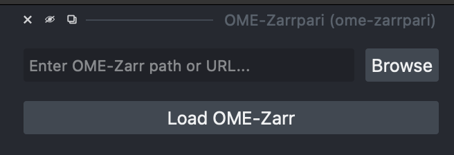

# ome-zarrpari

Load and use OME-Zarr 0.4 and 0.5 images and labels in napari, from any data source!

Images are loaded into a *napari multiscale image layer*.
This means higher resolution levels of the data are progressively loaded as you zoom in.

This plugin also: loads label groups; sets axis labels, units, and scales.

## Usage
This is what the widget looks like:



You can either copy/paste a URL or local path into the text box, or press "Browse" to open a file browser and select a local directory.
Then press the "Load OME-Zarr" button to load the image.

### Programmatic usage
If you already have a Zarr group you want to add to a napari Viewer, you can use:

::: ome_zarrpari.load_ome_zarr
    options:
      heading_level: 4


## Installing

```
pip install ome-zarrpari
```

If napari is not already installed, you can install `ome-zarrpari` with napari and Qt via:

```
pip install "ome-zarrpari[all]"
```

!!! warning

    After installing, be sure to enable napari's asyncronous mode.
    Without this browsing data will be very slow.
    You can either go to "Preferences" > "Experimental" to enable it, or set the `ASYNC_NAPARI` environment variable to 1 before launching napari.


## FAQ

### What's the difference between `ome-zarrpari` and [`napari-ome-zarr`](https://napari-hub.org/plugins/napari-ome-zarr)?

- `napari-ome-zarr` has no widget.
  The only way to load remote datasets is launching `napari` on the command line, or using Python scripting in the `napari` terminal.
- `ome-zarrpari` supports OME-Zarr 0.4 and 0.5; `napari-ome-zarr` only supports version 0.4 (as of writing).
- `ome-zarrpari` explicitly supports all versions of Python supported by `napari`.

### How can I process OME-Zarr data once it's been loaded?

Images are loaded into napari multiscale images.
The list of images in `napari` can be found in the `viewer.layers` list.
Each multiscale image in the list has a `image.data` attribute, which stores a list of the multiscale image levels.
Each item in this list is a `dask.Array`, which wraps a `zarr.Array` under the hood.
The image at index `i` is downsampled by a factor of `2**i`.
